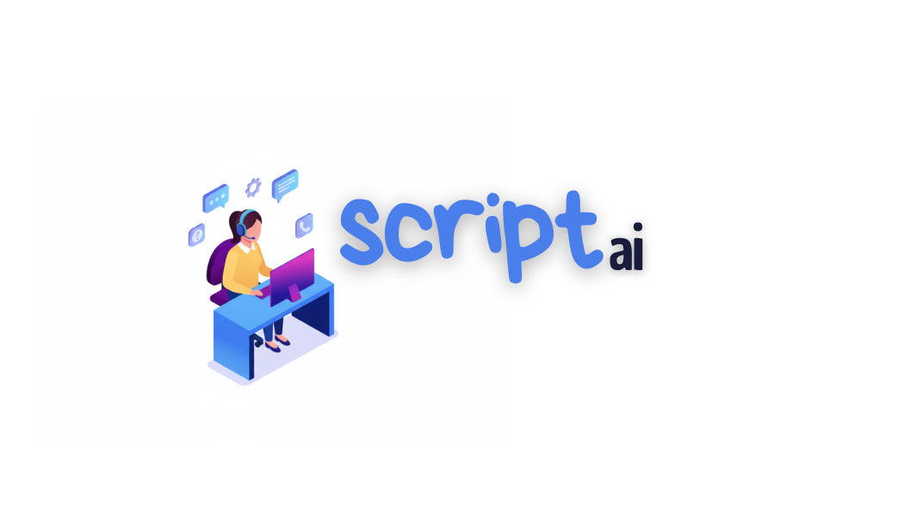
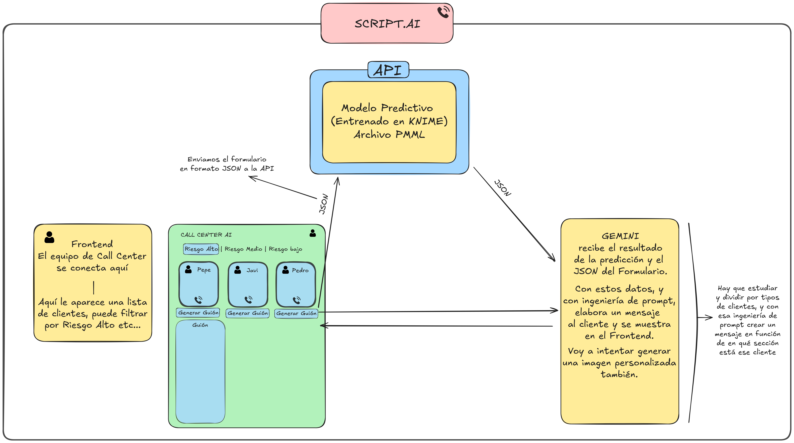

# 📞 Script AI - Predicción de Churn + Generación de Guiones con IA

<div align="center">


</div>

<p align="center">
  
</p>

<div align="center">

**Sistema inteligente para predecir y prevenir el abandono de clientes mediante Machine Learning e IA Generativa**

[Características](#-descripción-del-proyecto) •
[Tecnologías](#-stack-Tecnológico) •
[Instalación](#-instalación-y-ejecución) •
[Documentación](#-metodología-crisp-dm)

</div>

---

## 🎯 Descripción del Proyecto

Este proyecto tiene como objetivo identificar a los clientes que están en **riesgo de abandonar el servicio** (churn) en un futuro cercano, permitiendo a las empresas actuar de manera proactiva ofreciendo **incentivos personalizados**, descuentos o mejoras en el servicio antes de que tomen la decisión de irse.

### 🚀 Más allá del proyecto base

No solo creamos un modelo predictivo tradicional. Este proyecto va mucho más allá:

✅ **API REST** desplegable en la nube para predicciones en tiempo real  
✅ **Dashboard interactivo** para visualizar clientes en riesgo  
✅ **Generación automática de guiones** de retención personalizados con IA  
✅ **Arquitectura escalable** con Docker y FastAPI  
✅ **Pipeline completo** desde datos crudos hasta producción  

---

## 🧭 Metodología CRISP-DM

El desarrollo del proyecto sigue la metodología **CRISP-DM** (Cross-Industry Standard Process for Data Mining):

| Fase | Descripción | Notebook |
|------|-------------|----------|
| 1️⃣ **Business Understanding** | Definición del problema y objetivos | [📓 Ver análisis](documentation/data_analysis.ipynb) |
| 2️⃣ **Data Understanding** | Exploración y análisis de datos | [📓 Ver análisis](documentation/data_analysis.ipynb) |
| 3️⃣ **Data Preparation** | Limpieza y transformación | [📓 Ver modelo](documentation/model_creation.ipynb) |
| 4️⃣ **Modeling** | Entrenamiento de modelos | [📓 Ver modelo](documentation/model_creation.ipynb) |
| 5️⃣ **Evaluation** | Validación y métricas | [📓 Ver modelo](documentation/model_creation.ipynb) |
| 6️⃣ **Deployment** | Despliegue en producción | [📓 Ver modelo](documentation/model_creation.ipynb) |

---

## 🧩 Arquitectura del Sistema

<p align="center">
  
</p>

El sistema consta de tres componentes principales:

1. **📊 Modelo ML**: XGBoost entrenado para predecir probabilidad de churn
2. **🔌 API REST**: FastAPI que expone endpoints para predicciones
3. **💻 Dashboard**: Interfaz web para visualizar clientes en riesgo

---

## 📦 Instalación y Ejecución

### Prerrequisitos

Asegúrate de tener instalado:
- **Docker** (versión 20.0 o superior)
- **Git**

### 🚀 Opción 1: Ejecutar con Docker (Recomendado)

```bash
# 1. Clonar el repositorio
git clone https://github.com/javiperlo/script_ai.git
cd script_ai

# 2. Construir la imagen Docker
docker build -t script-ai:latest .

# 3. Ejecutar el contenedor
docker run -d -p 8000:8000 --name script-ai-api script-ai:latest

# 4. Verificar que está corriendo
docker ps
```

**🌐 Acceder a la aplicación:**
- API Docs: http://localhost:8000/docs
- Dashboard: Abre `frontend/index.html` en tu navegador

---

## 🔌 Uso de la API

### Endpoint: Predicción de Churn

**POST** `/predict`

```bash
curl -X POST "http://localhost:8000/predict" \
  -H "Content-Type: application/json" \
  -d '{
    "gender": "Female",
    "SeniorCitizen": 0,
    "Partner": "No",
    "Dependents": "No",
    "tenure": 11,
    "PhoneService": "Yes",
    "MultipleLines": "Yes",
    "InternetService": "Fiber optic",
    "OnlineSecurity": "No",
    "OnlineBackup": "No",
    "DeviceProtection": "Yes",
    "TechSupport": "No",
    "StreamingTV": "Yes",
    "StreamingMovies": "Yes",
    "Contract": "Month-to-month",
    "PaperlessBilling": "Yes",
    "PaymentMethod": "Bank transfer (automatic)",
    "MonthlyCharges": 97.85,
    "TotalCharges": 1105.4
  }'
```

**Respuesta:**
```json
{
  "probabilidad_churn": 0.8542,
  "CHURN": true,
  "umbral_utilizado": 0.65
}
```
### Endpoint: Generar Script con Gemini

**POST** `/generate_script`

```bash
curl -X POST "http://localhost:8000/generate_script" \
  -H "Content-Type: application/json" \
  -d '{
    "nombre": "",
    "edad": 0,
    "probabilidad_churn": "No",
  }'
```

**Respuesta**
```json
{
  "guion": "" 
}
```

---


## 📊 Métricas del Modelo

| Métrica | Valor |
|---------|-------|
| **Accuracy** | 82.5% |
| **Precision** | 78.3% |
| **Recall** | 71.2% |
| **F1-Score** | 74.6% |
| **ROC-AUC** | 0.87 |

---

## 🛠️ Stack Tecnológico

| **Categoría** | **Tecnologías** | **Descripción** |
|----------------|-----------------|-----------------|
| **Backend & API** |     | **Python 3.11** como lenguaje principal.<br>**FastAPI** para desarrollo de API REST.<br>**Docker** para contenedorización.<br>**Uvicorn** como servidor ASGI. |
| **Machine Learning** |      | **Scikit-Learn** para preprocesamiento y pipelines.<br>**XGBoost** como modelo principal de predicción.<br>**Pandas** y **NumPy** para análisis de datos.<br>**Joblib** para serialización del modelo.<br>**KNIME** como entorno visual de modelado. |
| **Frontend** |   | **HTML5** para la estructura del dashboard.<br>**JavaScript (ES6+)** para la lógica y consumo de la API. |
| **Herramientas de Desarrollo** |    | **Git** para control de versiones.<br>**Jupyter Notebook** para análisis exploratorio.<br>**VS Code** como entorno de desarrollo principal. |

___

## 📄 Licencia

Este proyecto está bajo la Licencia MIT - ver el archivo [LICENSE](LICENSE) para más detalles.

---

## 🙏 Agradecimientos

- Dataset: [Telco Customer Churn - Kaggle](https://www.kaggle.com/datasets/blastchar/telco-customer-churn)
- Trabajo: Proyecto de la asignatura de Fundamentos de Data Science de ENAE Business School

---

<div align="center">

**👨‍💻 Desarrollado por [@javiperlo](https://github.com/javiperlo)**

Made with ❤️ and ☕

</div>